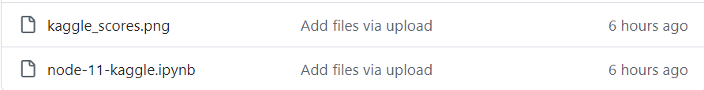
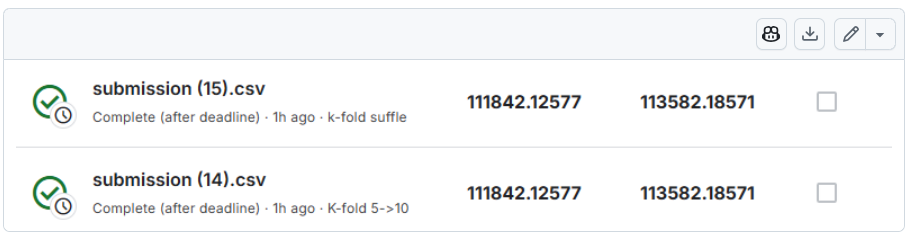
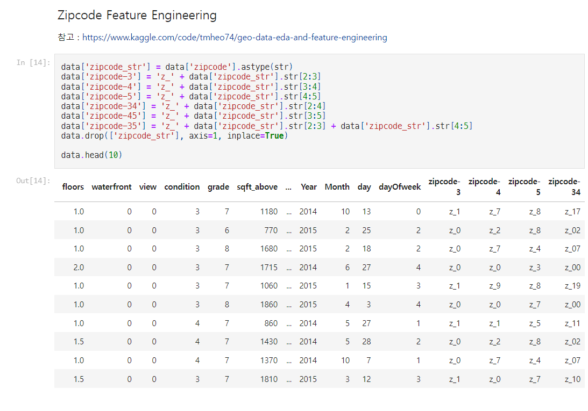
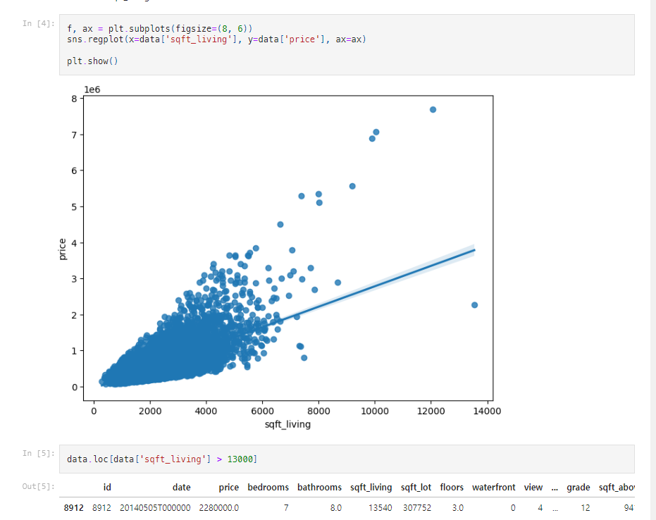

# AIFFEL Campus Online Code Peer Review Templete
- 코더 : 정다운
- 리뷰어 : 김천지


# PRT(Peer Review Template)
- [X]  **1. 주어진 문제를 해결하는 완성된 코드가 제출되었나요?**
    - 문제에서 요구하는 최종 결과물이 첨부되었는지 확인
    - 
    - 
    - 문제를 해결한 노트북 파일과 캐글에 submission을 제출한 파일 모두 정상적으로 첨부되었음을 확인하였습니다.  
    - 캐글 스코어가 가까스로 목표치를 상회하는 것이 아쉽습니다ㅠㅠ

- [X]  **2. 전체 코드에서 가장 핵심적이거나 가장 복잡하고 이해하기 어려운 부분에 작성된 
주석 또는 doc string을 보고 해당 코드가 잘 이해되었나요?**
    - 해당 코드 블럭을 왜 핵심적이라고 생각하는지 확인
    - 해당 코드 블럭에 doc string/annotation이 달려 있는지 확인
    - 해당 코드의 기능, 존재 이유, 작동 원리 등을 기술했는지 확인
    - 주석을 보고 코드 이해가 잘 되었는지 확인
        - 중요! 잘 작성되었다고 생각되는 부분을 캡쳐해 근거로 첨부
    - 
    - zipcode에 대해서 자료 조사를 많이 하신 것 같아 보입니다. geo data를 eda하는 방법의 링크가 첨부되어 있습니다.
    - zipcode 칼럼으로 feature engineering진행하여 다양한 칼럼들을 만들어내는 방법을 적용한 것이 인상깊었습니다. 저는 zipcode가 유의미한 정보를 담고 있다는 사실은 알았지만, 이러한 방식으로 zipcode를 나눌 수 있는 방법은 생각하지 못했는데 좋은 인사이트를 얻어갑니다.
    

        
- [X]  **3. 에러가 난 부분을 디버깅하여 문제를 해결한 기록을 남겼거나
새로운 시도 또는 추가 실험을 수행해봤나요?**
    - 문제 원인 및 해결 과정을 잘 기록하였는지 확인
    - 프로젝트 평가 기준에 더해 추가적으로 수행한 나만의 시도, 
    실험이 기록되어 있는지 확인
        - 중요! 잘 작성되었다고 생각되는 부분을 캡쳐해 근거로 첨부
        - 
        - sqft_living 칼럼의 내용을 분석 및 시각화하여 이상치를 찾아내는 것이 인상깊었습니다.
        - 저도 이 방법을 적용하였다면 모델의 loss를 조금이나마 더 줄일 수 있었을 것 같습니다.
        
- []  **4. 회고를 잘 작성했나요?**
    - 주어진 문제를 해결하는 완성된 코드 내지 프로젝트 결과물에 대해
    배운점과 아쉬운점, 느낀점 등이 기록되어 있는지 확인
    - 전체 코드 실행 플로우를 그래프로 그려서 이해를 돕고 있는지 확인
        - 중요! 잘 작성되었다고 생각되는 부분을 캡쳐해 근거로 첨부
    - 회고의 내용은 나타나있지 않습니다.
        
- [X]  **5. 코드가 간결하고 효율적인가요?**
    - 파이썬 스타일 가이드 (PEP8) 를 준수하였는지 확인
    - 코드 중복을 최소화하고 범용적으로 사용할 수 있도록 함수화/모듈화했는지 확인
        - 중요! 잘 작성되었다고 생각되는 부분을 캡쳐해 근거로 첨부
    - 첨부할 부분이 많아서 스크린샷은 생략합니다.
    - 전반적인 코드 블럭마다 마크다운으로 코드에 대한 설명이 잘 되어 있어서 이해가 쉽습니다.
    


# 회고(참고 링크 및 코드 개선)
```
    새벽까지 계속 진행하느라 정말 고생 많으셨습니다ㅠㅠ
    loss값 줄이는 게 정말 쉽지 않은 것 같습니다.
```
