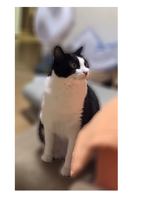
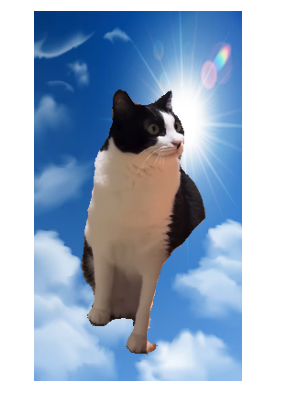
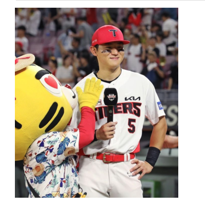
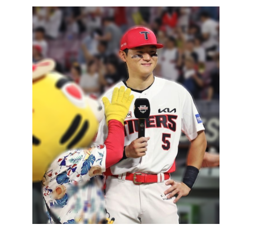
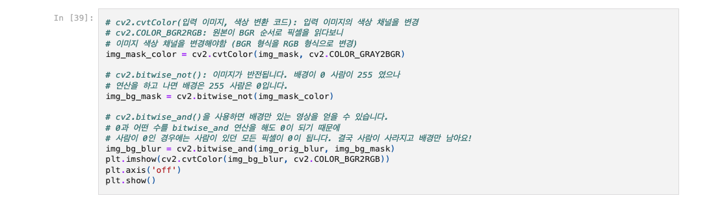
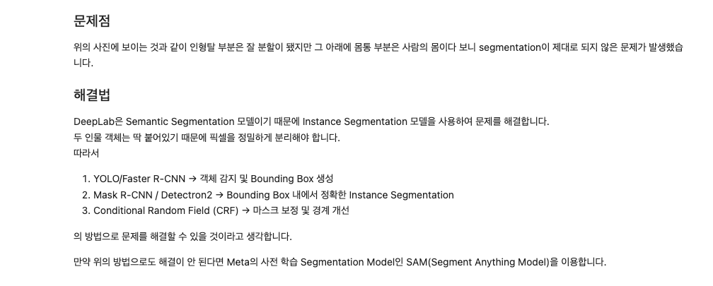
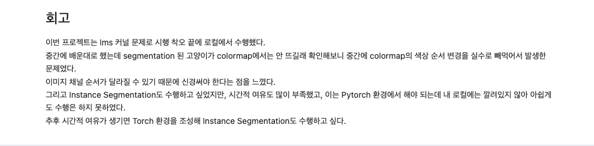

# AIFFEL Campus Online Code Peer Review Templete
- 코더 : 정 다운
- 리뷰어 : 김 영만

# PRT(Peer Review Template)
- [*]  **1. 주어진 문제를 해결하는 완성된 코드가 제출되었나요?**
    - 고양이에 대한 아웃포커싱 사진을 완료 하였습니다.
        -  
        -  
    - 배경 사진을 다른 이미지로 교체하는 크로마키 배경 합성을 완료 하였습니다.
        -  
    - 인물에 대한 아웃포커싱 사진을 완료 하였습니다.
        -  
        -    
- [*]  **2. 전체 코드에서 가장 핵심적이거나 가장 복잡하고 이해하기 어려운 부분에 작성된 
           주석 또는 doc string을 보고 해당 코드가 잘 이해되었나요?**
    - 이미지 블러를 위한 중요한 로직인데 주석이 상세히 작성 되어 이해 하기 쉬었습니다.
        -         
- [*]  **3. 에러가 난 부분을 디버깅하여 문제를 해결한 기록을 남겼거나
      새로운 시도 또는 추가 실험을 수행해봤나요?**
    - 인물에 대한 아웃 포커싱 문제점에 대해 해결 방안을 도출 해 놓아 도움이 되었습니다.
        - 
- [*]  **4. 회고를 잘 작성했나요?**
    - lms 환경/instance segmentation 등에 대해 회고가 잘 작성되어 있습니다.
         -        
- [ ]  **5. 코드가 간결하고 효율적인가요?**
    - 파이썬 스타일 가이드 (PEP8) 를 준수하였는지 확인
    - 코드 중복을 최소화하고 범용적으로 사용할 수 있도록 함수화/모듈화했는지 확인
        - 중요! 잘 작성되었다고 생각되는 부분을 캡쳐해 근거로 첨부

# 회고(참고 링크 및 코드 개선)
인물에 대한 아웃 포커싱 해결을 위한 방법을 자세히 기술 되어 있어
도움이 많이 되었습니다.

