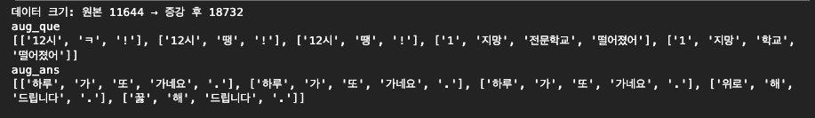
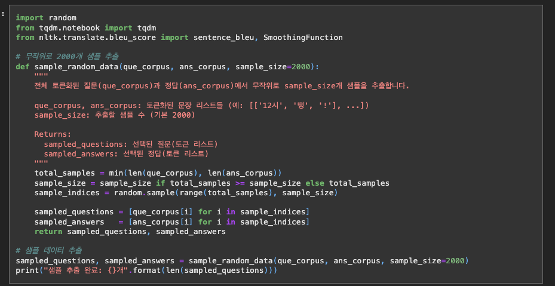
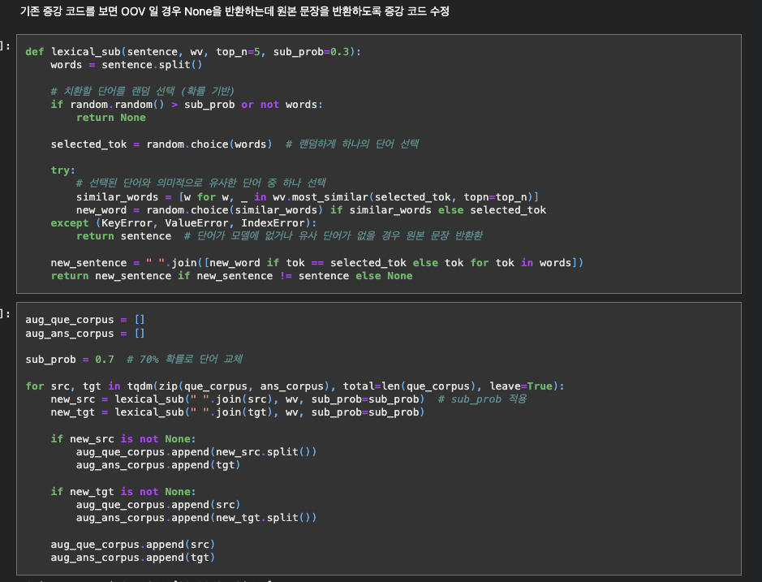
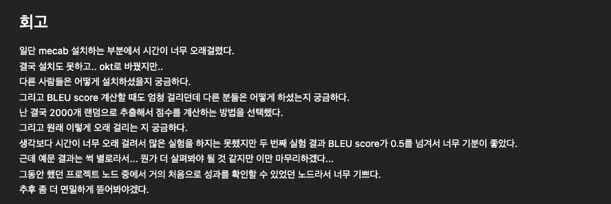
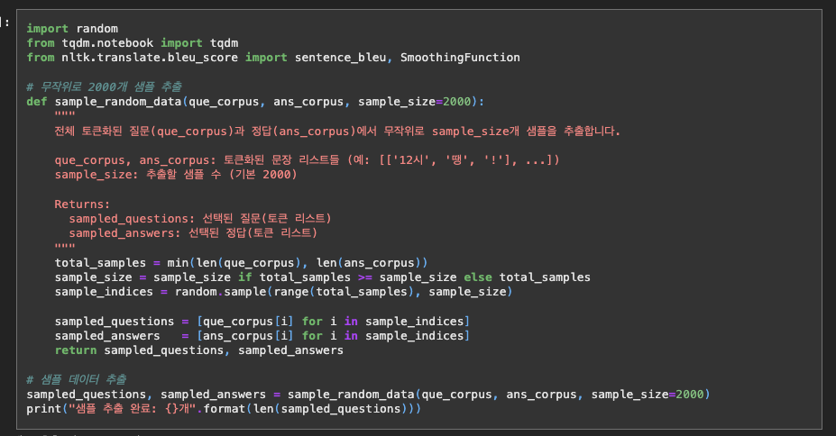

# AIFFEL Campus Online Code Peer Review Templete
- 코더 : 정 다운
- 리뷰어 : 김 영만


# PRT(Peer Review Template)
- [*]  **1. 주어진 문제를 해결하는 완성된 코드가 제출되었나요?**
    - 데이터 전처리 및 증가을 완료 하였습니다.
        - 
    - 챗봇을 학습시키고 대화 결과를 생성 하였습니다.
        - 
    
- [*]  **2. 전체 코드에서 가장 핵심적이거나 가장 복잡하고 이해하기 어려운 부분에 작성된 
주석 또는 doc string을 보고 해당 코드가 잘 이해되었나요?**
    - 전체 데이터의 blue 스코어 구하는데 시간이 너무 걸려 샘플링 한 부분이 주석과 함께 잘 정리 되어 있습니다.
        - 
        
- [*]  **3. 에러가 난 부분을 디버깅하여 문제를 해결한 기록을 남겼거나
새로운 시도 또는 추가 실험을 수행해봤나요?**
    - 데이터 증강시 OOV 문제로 실패한 부분에 대한 기록과 수정 기록이 있습니다.
        - 
        
- [*]  **4. 회고를 잘 작성했나요?**
    - 로컬의 MeCab 설치와 blue 스코어의 샘플링등 과제 진행시의 어려움과 추후 진행 할 내용이 있습니다.
        - 
        
- [*]  **5. 코드가 간결하고 효율적인가요?**
    - 파이썬 스타일 가이드 (PEP8)에 따른 코드 내 주석이 잘 되어 있습니다.
        - 


# 회고(참고 링크 및 코드 개선)
```
과제 완료 하시느라 수고 많이 하셨습니다.
첫 성공의 기운을 쭉 이어 가시어 모든 프로젝트 완료 하십시요.:)
```
