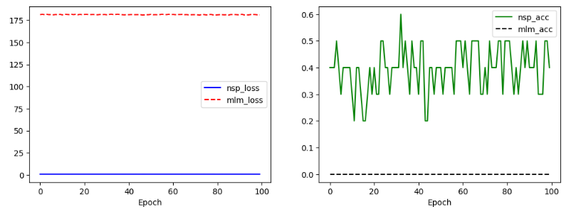
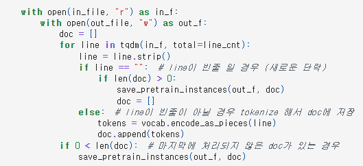
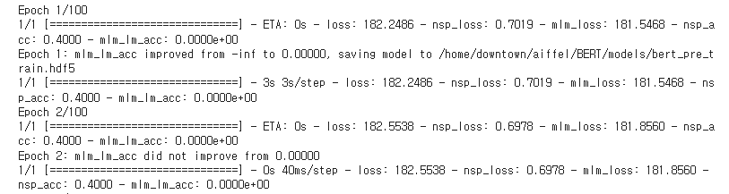
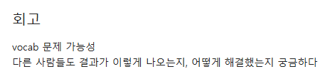
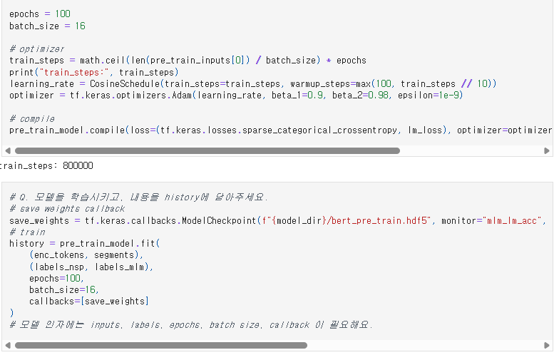
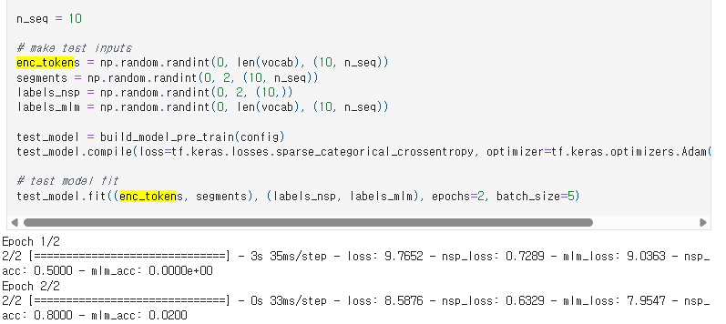
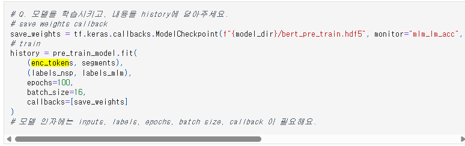

# AIFFEL Campus Online Code Peer Review Templete
- 코더 : 정다운
- 리뷰어 : 염철헌


# PRT(Peer Review Template)
- [X]  **1. 주어진 문제를 해결하는 완성된 코드가 제출되었나요?**
    - 문제에서 요구하는 최종 결과물이 첨부되었는지 확인
        - 중요! 해당 조건을 만족하는 부분을 캡쳐해 근거로 첨부
        - 역전파가 진행되는 훈련 전 과정을 수행하였으나 뭔가 이상함
        - 일단 각 배치를 클리어하는데 35ms 밖에 들지 않았다는 것은 배치 내에 데이터가 얼마 없다는 뜻인데... 어디서 잘못 되었나 파악해야함
        - 파악했고, 회고에 적어놓음
        - 
    
- [X]  **2. 전체 코드에서 가장 핵심적이거나 가장 복잡하고 이해하기 어려운 부분에 작성된 
주석 또는 doc string을 보고 해당 코드가 잘 이해되었나요?**
    - 해당 코드 블럭을 왜 핵심적이라고 생각하는지 확인
    - 해당 코드 블럭에 doc string/annotation이 달려 있는지 확인
    - 해당 코드의 기능, 존재 이유, 작동 원리 등을 기술했는지 확인
    - 주석을 보고 코드 이해가 잘 되었는지 확인
        - 중요! 잘 작성되었다고 생각되는 부분을 캡쳐해 근거로 첨부
        - make_pretrain_data 함수 부분에 있어 노드에서 직접 작성해야 하는 부분을 주석과 함께 잘 작성해주셨음
        - 
        
- [X]  **3. 에러가 난 부분을 디버깅하여 문제를 해결한 기록을 남겼거나
새로운 시도 또는 추가 실험을 수행해봤나요?**
    - 문제 원인 및 해결 과정을 잘 기록하였는지 확인
    - 프로젝트 평가 기준에 더해 추가적으로 수행한 나만의 시도, 
    실험이 기록되어 있는지 확인
        - 중요! 잘 작성되었다고 생각되는 부분을 캡쳐해 근거로 첨부
        - model.fit 과정에서 데이터를 잘못 설정해 학습이 잘못 진행된 부분이 있었고, 그럼에도 모델 자체는 잘 동작해 역전파가 이루어졌음
        - PR 과정에서 먼저 말씀해주셨고, 잘 잡아낼 수 있었다.
        - 이 부분은 리뷰어 회고란에 더 작성
        - 
        
- [X]  **4. 회고를 잘 작성했나요?**
    - 주어진 문제를 해결하는 완성된 코드 내지 프로젝트 결과물에 대해
    배운점과 아쉬운점, 느낀점 등이 기록되어 있는지 확인
    - 전체 코드 실행 플로우를 그래프로 그려서 이해를 돕고 있는지 확인
        - 중요! 잘 작성되었다고 생각되는 부분을 캡쳐해 근거로 첨부
        - 1번 사진과 관련해 accuracy가 불규칙하게 튀는 양상을 회고와 함께 지적하셨다
        - 
        
- [X]  **5. 코드가 간결하고 효율적인가요?**
    - 파이썬 스타일 가이드 (PEP8) 를 준수하였는지 확인
    - 코드 중복을 최소화하고 범용적으로 사용할 수 있도록 함수화/모듈화했는지 확인
        - 중요! 잘 작성되었다고 생각되는 부분을 캡쳐해 근거로 첨부
        - 서브클래싱으로 모델을 구성했고, 이하 기존 keras의 도구를 활용하여 compile 및 fit까지 성공적으로 수행함
        - 


# 회고(참고 링크 및 코드 개선)
```
# 한 줄 요약: model.fit 내부에 x = pre_train_inputs, y = pre_train_labels 쓰기
# 테스트 데이터로 모델 구동을 테스트하는 과정에서 인풋인 enc_tokens과 레이블인 segments을 더미로 하나 형성했는데, 실수로 이를 실제 train 과정에서도 그대로 사용해서 발생한 문제
```



